<h1 align ="center" > GYM SERGIO FITNESS MERN APLICATION </h1>
<h4  align ="center"> 
Fullstack open source application, dynamic GYM CONTROL website(MERN STACK)</h4>
 <h4  align ="center"> Made with NEXTJS, MongoDB, Express, Nodejs(20.11.1), GRAPHQL, Apollo V3  </h4>
<br>
<br>

  * [Configuration and Setup](#configuration-and-setup)
  * [Key Features](#key-features)
  * [Technologies used](#technologies-used)
      - [Frontend](#frontend)
      - [Backend](#backend)
      - [Database](#database)
  * [📸 Screenshots](#screenshots)
  * [Author](#author)
  * <br>
  

## Configuration and Setup 
## <h2> ⚙️ </h2>

In order to run this project locally, simply fork and clone the repository or download as zip and unzip on your machine.

- Open the project in your prefered code editor.
- Go to terminal -> New terminal (If you are using VS code)
- Split your terminal into two (run the client on one terminal and the server on the other terminal)

In the first terminal

```
$ cd client
$ npm install (to install client-side dependencies)
$ npm run start (to start the client), or ng serve

First time running the project, must register Admin on login(register), to enter to admin area.
```
```
In the second terminal

- cd server and Set environment variables in .env
- Create your mongoDB connection url, which you'll use as your MONGO_URL
- Supply the following credentials

# --- Terminal ---

$ npm install (to install server-side dependencies)
$ npm start (to start the server), or nodemon server

```


##  🔌 Technologies used ✔️:


##  Screenshots:
📸
<br>
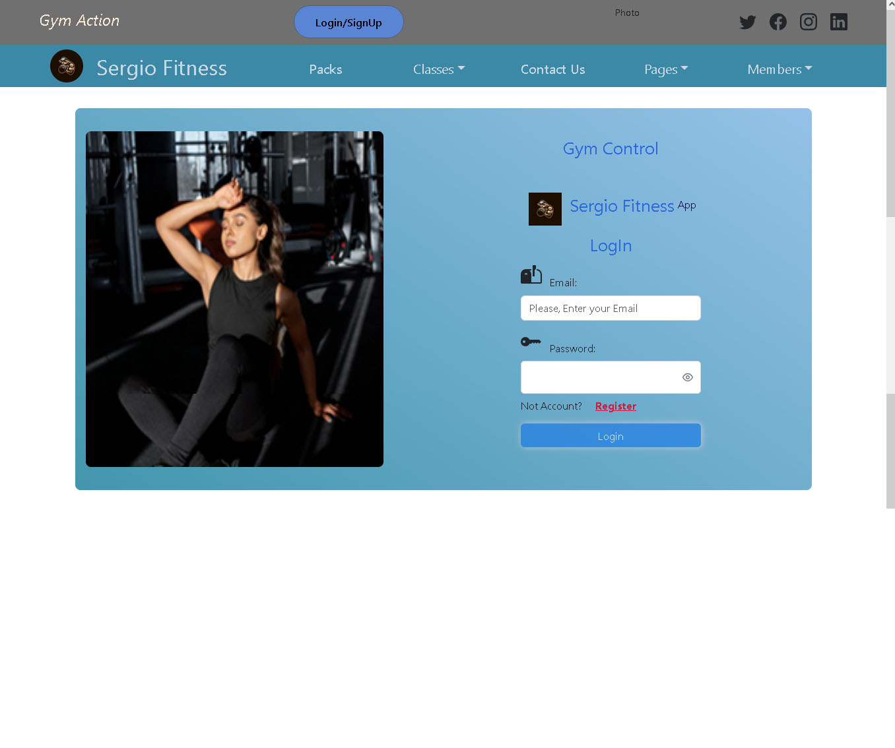
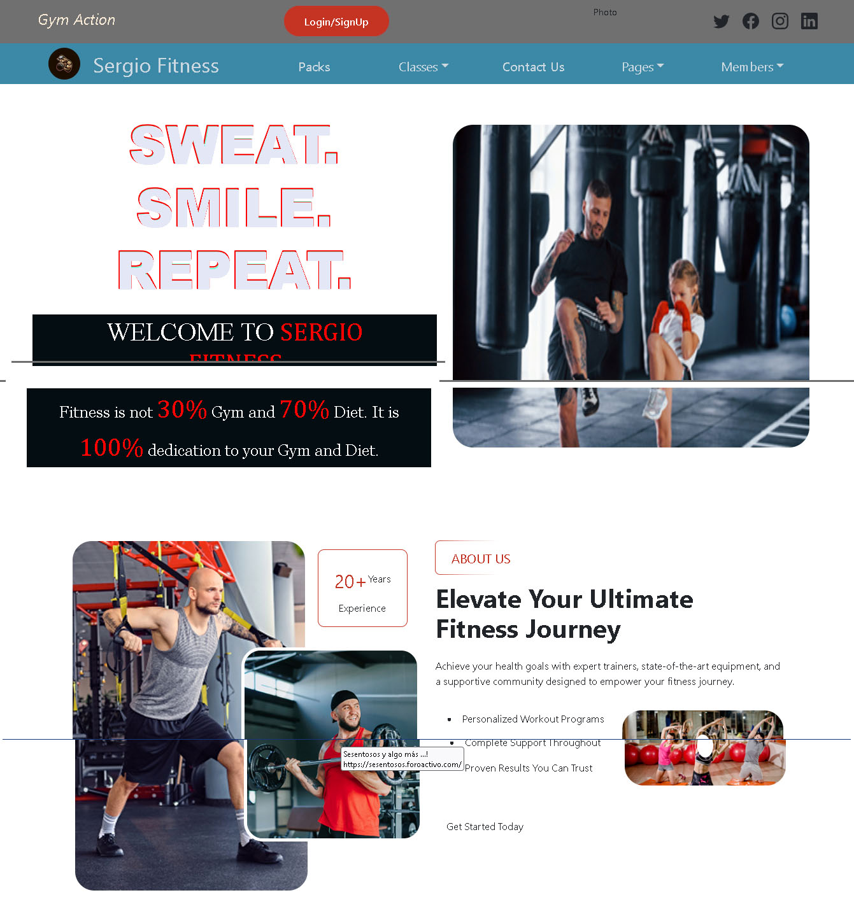
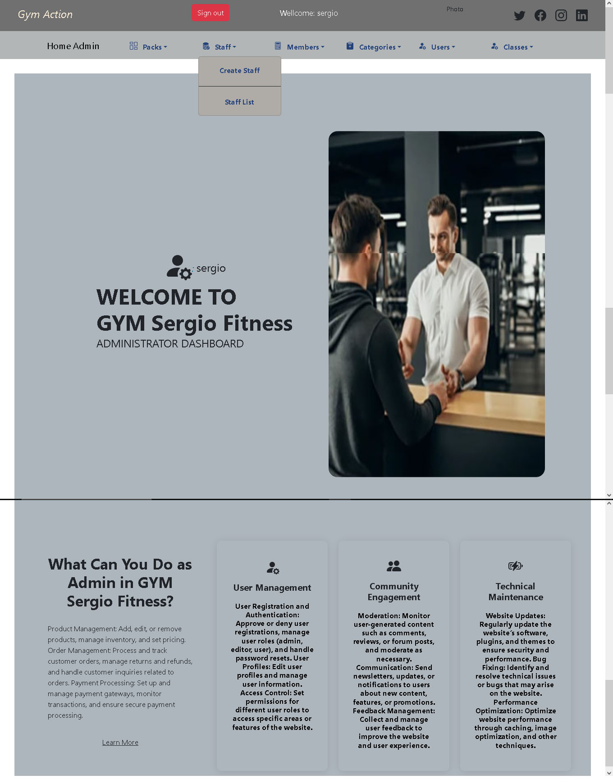
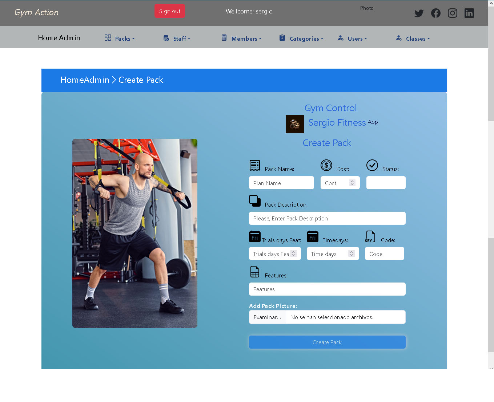
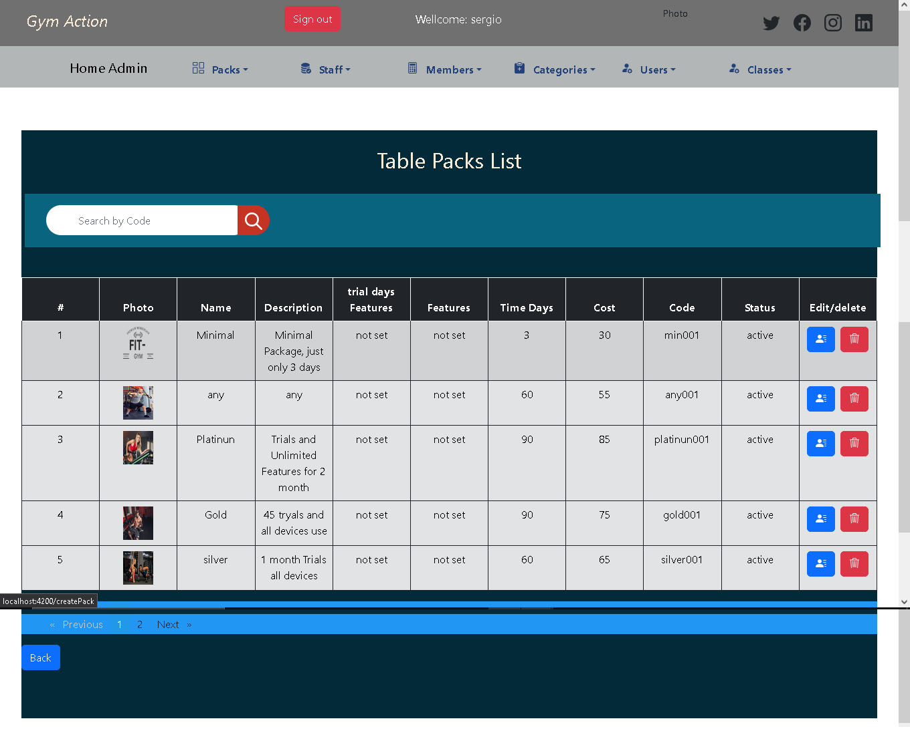
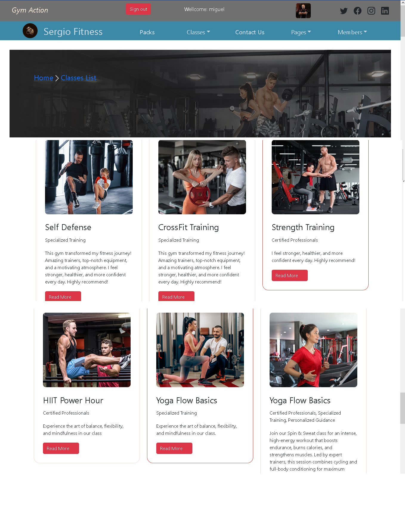
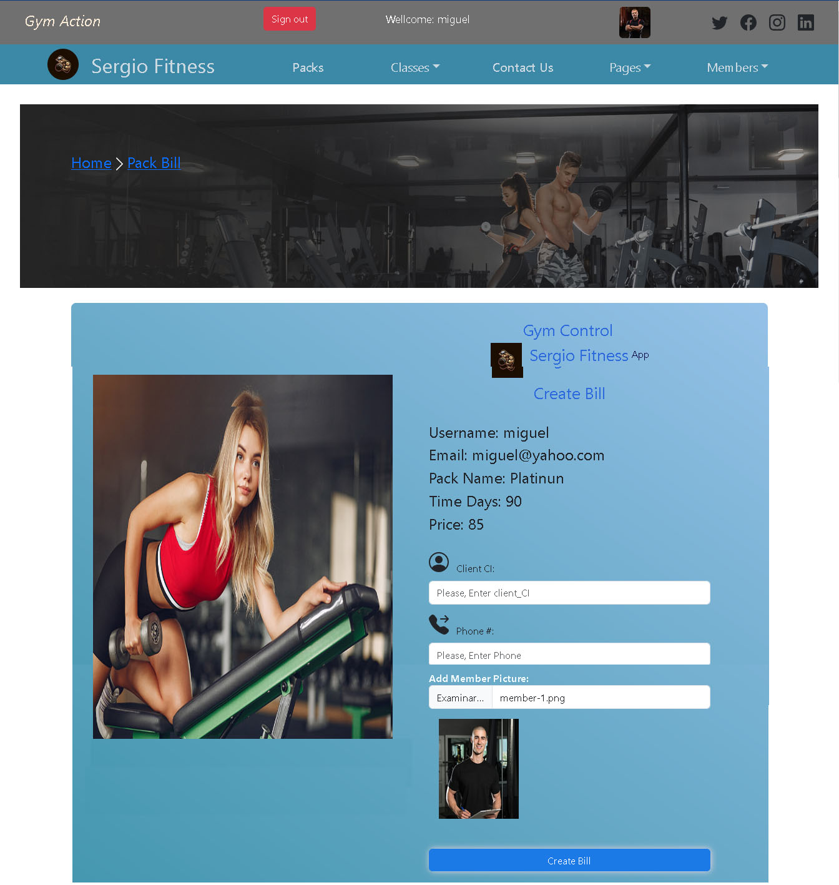
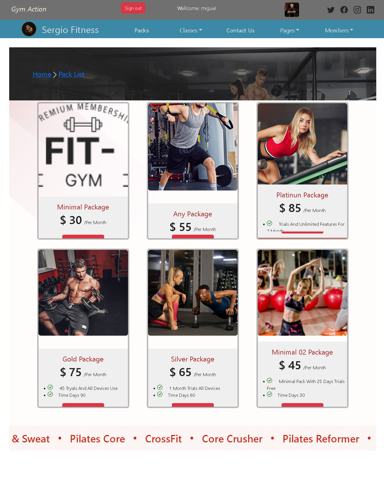
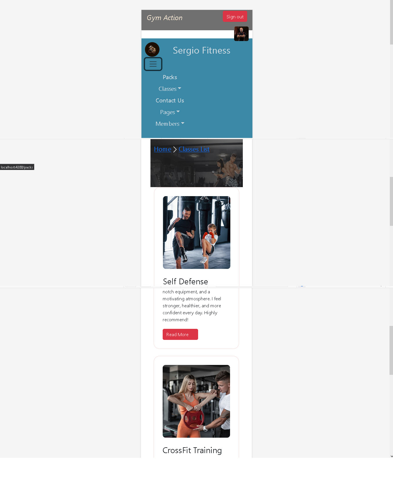
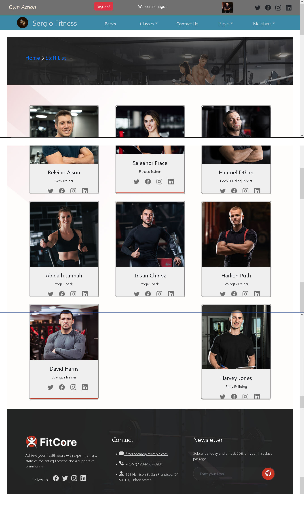
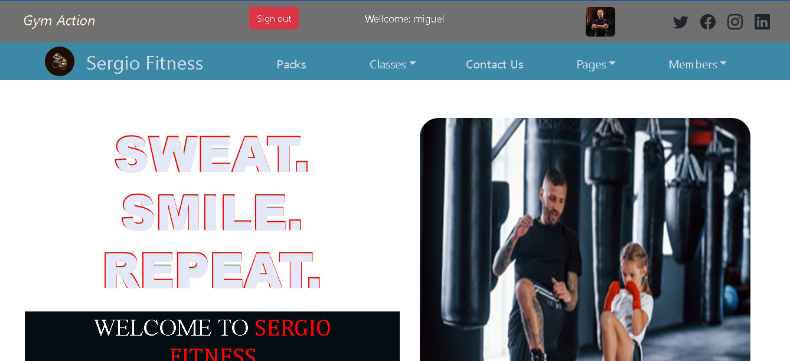
<br>

##  Key Features:

- Admin Area
- Add/Edit/Delete Packs,Users,Members,classes, sales.
- User Authenication
- Admin  Authenication
- See Packs, classes, members, staff List.

##  Technologies used

📋 This project was created using the following technologies.

####  Frontend 

- [Angular 18.2.0](https://angular.dev/) - JavaScript library that is used for building user interfaces specifically for single-page applications.
- [Bootstrap 5.2.2](https://getbootstrap.com/docs/5.0/getting-started/introduction/) - Framework for building responsive, mobile-first sites, with jsDelivr and a template starter page.
- [rxjs](https://angular.io/guide/rx-library) - Reactive Extensions Library for JavaScript.

####  Backend 

- [Node js](https://nodejs.org/en/) -A runtime environment to help build fast server applications using JS
- [Express js](https://www.npmjs.com/package/express) -The server for handling and routing HTTP requests
- [Mongoose](https://mongoosejs.com/) - For modeling and mapping MongoDB data to JavaScript
- [jsonwebtoken](https://www.npmjs.com/package/jsonwebtoken) - For authentication
- [cookie-parser](https://www.npmjs.com/package/cookie-parser) - Middleware module used in Node.js web applications to manage cookies
- [Multer](https://www.npmjs.com/package/multer) - Multer is a node.js middleware for handling multipart/form-data, which is primarily used for uploading files. 
- [cors](https://www.npmjs.com/package/cors) - Provides a Connect/Express middleware
- [Dotenv](https://www.npmjs.com/package/dotenv) - Zero Dependency module that loads environment variables
- [express-validator](https://www.npmjs.com/package/express-validator) - Used in Node.js applications with the Express framework to validate data submitted by users (user input)
- [nodemon](https://nodemon.io/) - Development utility for Node.js applications. Node.js is a runtime platform that allows you to run JavaScript on the server side.t
- [GraphQl, Apollo V3](https://nodemon.io/) - GraphQL is an open‑source query language for APIs and a server‑side runtime.


####  Database 

 - [MongoDB ](https://www.mongodb.com/) - It provides a free cloud service to store MongoDB collections.💾

## Author
     👨🏻‍🏫 
- Portfolio: 
- Github: 
- Sponsor: 
- Linkedin:(https://www.linkedin.com/in/sergio-moncada-rivas-4ab877351/)
- Email: :mailbox_with_mail:[sergiogmoncada@yahoo.com](mailto:sergiogmoncada@yahoo.com)
